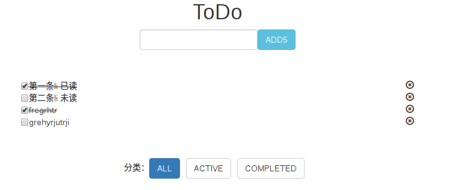
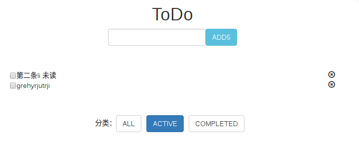
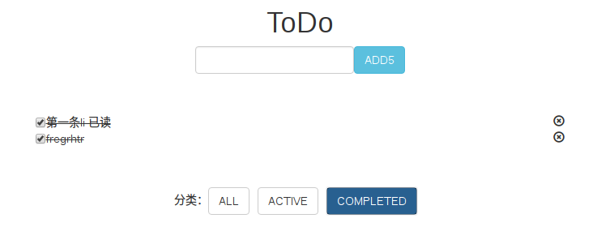

### demo 说明
在react中我们进行的都是对组件的操作，之前我们也学习了用props完成组件与组件之间的联系。但是props实现的是父组件向子组件的传递（react的单项数据流），但是很多时候我们想要实现的是子组件里的事件去改变父组件里的值，本例就实现这个功能。
### 功能说明
这里面有这几个功能需要去实现：

1.如图这个页面分为三个组件，上面文本框和add按钮为一个(App.js)；中间列表为一个(TodoList.js)；下面分类为一个(Classify.js)

2.实现在文本框中输入了内容后，在下面添加上文本内容。

3.勾选复选框，选中的消息划上删除线，未选中时去掉删除线。

4.点击小图标X，删除整个文本。

5.默认打开的是按钮All,全部显示。点击ACTIVE时，出现的是没有选中的li
如图：

6.点击completed，出现选过的li
如图：

7.本地存储历史记录功能。每次刷新仍然保存着之前操作过的行为。

---
方法：
JSON.stringify()
JSON.parse()
